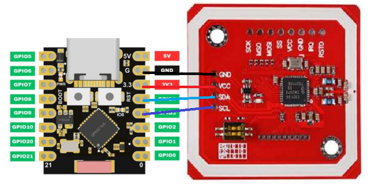
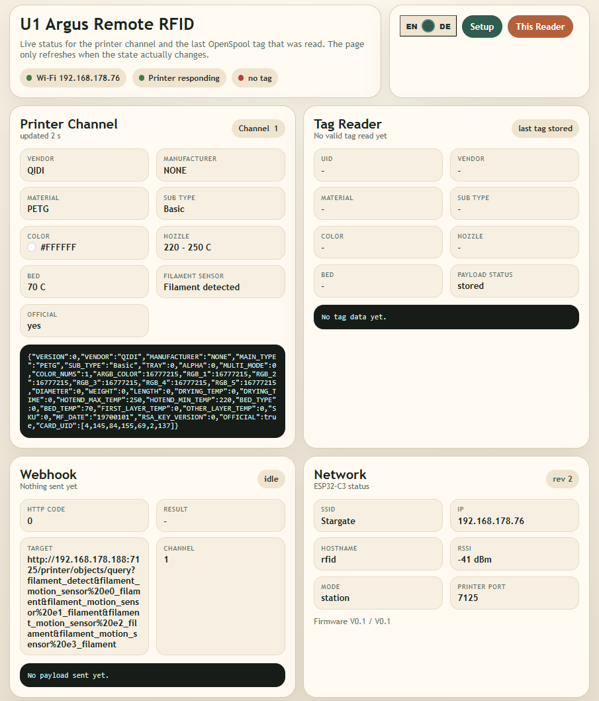
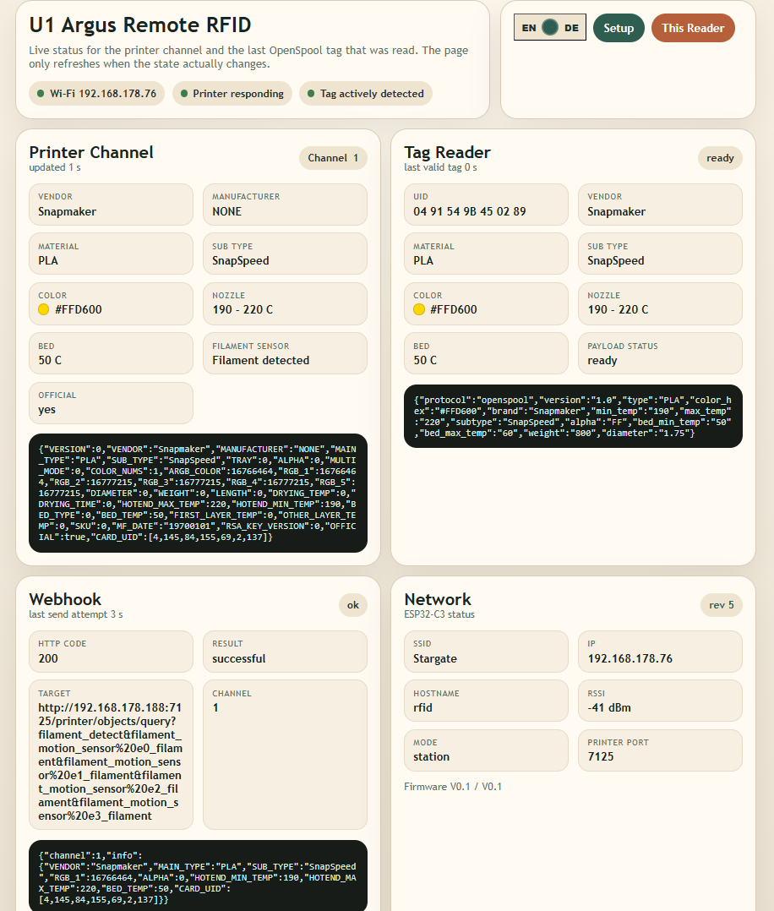
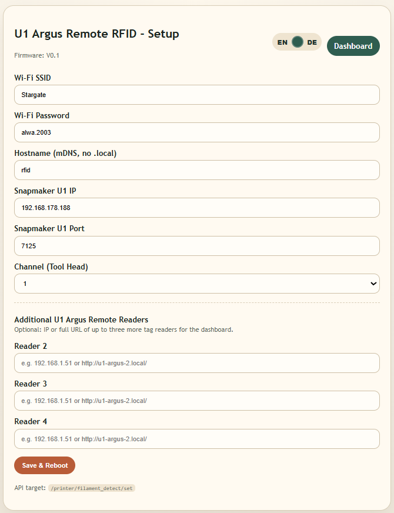
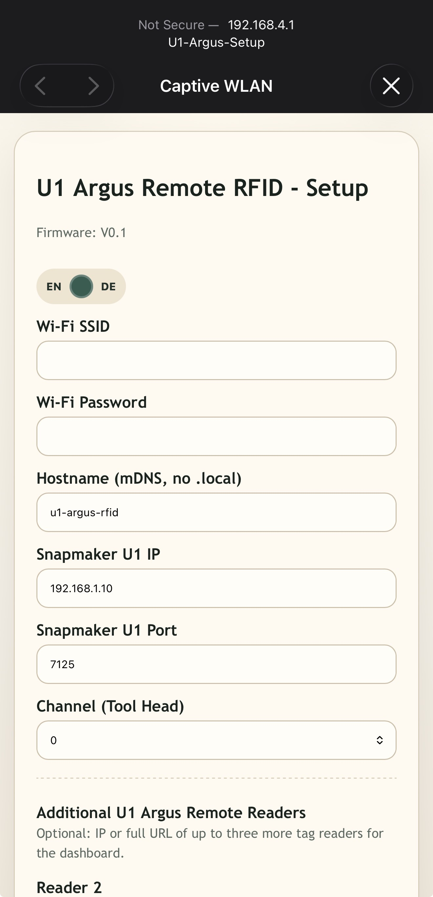

# U1 Argus Remote RFID

  

  Remote OpenSpool RFID reader for Snapmaker U1 with ESP32-C3 Super Mini and PN532.

  Reads OpenSpool NFC tags, maps them to the Snapmaker U1 external filament workflow, and shows a beautiful local dashboard with live channel and tag status.

  <a href="https://tinkerbarn.github.io/U1-Argus-Remote-RFID/"><strong>Open Web Installer</strong></a>
  ·
  <a href="./index.html"><strong>Installer Source In Repo</strong></a>

  

---

## What This Reader Can Do

- Read **OpenSpool Standard** RFID/NFC tags through a **PN532** in **HSU/UART** mode
- Send mapped filament information to a **Snapmaker U1** over the external filament-detection API
- Offer a built-in **setup hotspot** with captive portal for first configuration
- Persist Wi-Fi, printer, language, and dashboard-reader settings in ESP32 `Preferences`
- Serve a local **dashboard** that shows:
  - current printer channel information
  - last valid tag information
  - last webhook result
  - quick buttons to jump between up to **4 readers**
- Support **English and German** in setup, captive portal, dashboard, and web installer

---

## Before You Start

This project is intended for **Snapmaker U1** together with the **Extended Firmware by paxx12**:

- [paxx12 / SnapmakerU1-Extended-Firmware (develop)](https://github.com/paxx12/SnapmakerU1-Extended-Firmware/tree/develop)

Required printer-side setting:

- Open `http://<printer-ip>/firmware-config/`
- Set **Filament Detection** to **External**

Without that prerequisite, the remote RFID reader cannot update the U1 channel state correctly.

---

## Hardware

### Bill Of Materials

- **ESP32-C3 Super Mini**
- **PN532 NFC/RFID module**
- **4 hookup wires**
  Usually already included with many PN532 boards

### PN532 Mode

Use the PN532 in **HSU mode**.

Important note:

- On the common red PN532 breakout boards, **HSU/UART is usually already the default mode**
- The printed pin labels may still say `SDA` and `SCL`, even though the board is being used in HSU/UART mode

After the ESP32-C3 has been programmed, only a **USB cable for power** is needed.

The communication between **U1 Argus Remote RFID** and the **Snapmaker U1** then happens entirely over **Wi-Fi**.

---

## Wiring

### Schematic

  

### Pinout List

| ESP32-C3 Super Mini | PN532 board pin | Note |
| --- | --- | --- |
| `3V3` | `VCC` | Power |
| `GND` | `GND` | Ground |
| `GPIO3` | `SCL` | HSU TX line to PN532 board |
| `GPIO4` | `SDA` | HSU RX line from PN532 board |

The firmware release `V1.1` uses:

- `PN532_TX_PIN = 3`
- `PN532_RX_PIN = 4`

---

## Installation

### Web Installer

Use the web installer to flash the reader directly from the browser:

- `https://tinkerbarn.github.io/U1-Argus-Remote-RFID/`

Current web installer release:

- **V1.1**

Recommended browser:

- **Chrome** or **Edge**

Recommended steps:

1. Connect the **ESP32-C3 Super Mini** by USB
2. Open the web installer
3. Click **Install**
4. Select the correct serial device
5. Wait until flashing is finished

If the board is not detected immediately:

- reconnect the USB cable
- try Chrome or Edge
- on some boards, hold **BOOT** while connecting

If the ESP32-C3 needs to be forced into flashing mode:

1. Press and hold **BOOT**
2. Briefly press **RESET**
3. Release **RESET**
4. Release **BOOT**

Then start the flash process again in the web installer.

### Firmware Overview

| Version | Status | Source | Firmware |
| --- | --- | --- | --- |
| `V1.1` | Current release | [V1.1 source](./releases/V1.1/U1_Argus_Remote_RFID_V1.1.ino) | [firmware/V1.1](./firmware/V1.1/) |
| `V1.0` | Previous release | [V1.0 source](./releases/V1.0/U1_Argus_Remote_RFID_V1.0.ino) | [firmware/V1.0](./firmware/V1.0/) |

### Arduino Source Release

Release source:

- [releases/V1.1/U1_Argus_Remote_RFID_V1.1.ino](./releases/V1.1/U1_Argus_Remote_RFID_V1.1.ino)

Current working sketch:

- [dev/U1_Argus_Remote_RFID_current.ino](./dev/U1_Argus_Remote_RFID_current.ino)

### Arduino IDE

If you want to build or flash the source manually in Arduino IDE, install:

#### Board Package

- **ESP32 by Espressif Systems**

Recommended target board for this project:

- **ESP32C3 Dev Module**

#### Required Libraries

- **ArduinoJson**

#### Recommended First-Flash Option

For the first flash onto a board that previously had other firmware, it is recommended to enable:

- **Erase All Flash Before Sketch Upload**

This helps avoid stale settings in `Preferences`/NVS from older firmware.

---

## First Setup On The Device

On first boot, the reader opens this hotspot:

- **`U1-Argus-Setup`**

Normally the captive portal starts automatically.

If it does not open by itself:

- open `http://192.168.4.1` in the browser

Then configure the reader like this:

1. Enter the SSID of your home Wi-Fi
2. Enter the Wi-Fi password
3. Enter the IP address of your Snapmaker U1
4. Keep port `7125` unless you intentionally use a different port
5. Enter an mDNS name
   This must be unique if you use multiple readers
6. Choose the channel / tool head the reader belongs to
7. Optionally add already active readers as IP or full URL
   These later appear in the dashboard as quick-jump buttons
8. Save and reboot

After configuration, the dashboard can be opened with:

- `http://example.local`

Replace `example` with the hostname you entered in setup.

---

## Dashboard And Setup Screens

### Dashboard - Channel Status, No Tag Read Yet

  

### Dashboard - Tag Read And Channel Updated

  

### Setup

  

### Captive Portal

  

---

## Release V1.1

`V1.1` is the current source release.

Highlights:

- Built from the latest working sketch after `V1.0`
- Smaller firmware by removing the Adafruit PN532 dependency
- Raw PN532 HSU/UART transport for OpenSpool tag reading
- Persistent additional-reader setup fields for multi-reader dashboards
- Standard serial boot, Wi-Fi, mDNS, IP, and PN532 status output remains available

Release source:

- [releases/V1.1/U1_Argus_Remote_RFID_V1.1.ino](./releases/V1.1/U1_Argus_Remote_RFID_V1.1.ino)

Firmware folder:

- [firmware/V1.1](./firmware/V1.1/)

---

## Release V1.0

`V1.0` is the first public release of this repository.

Highlights:

- ESP32-C3 Super Mini + PN532 in **HSU/UART**
- OpenSpool tag readout over raw PN532 HSU transport
- Snapmaker U1 channel update through external filament-detection workflow
- Captive portal setup with persistent storage
- Live dashboard with printer query, tag state, webhook status, and multi-reader jump links
- English/German support in device UI and web installer

Release source:

- [releases/V1.0/U1_Argus_Remote_RFID_V1.0.ino](./releases/V1.0/U1_Argus_Remote_RFID_V1.0.ino)

Firmware folder:

- [firmware/V1.0](./firmware/V1.0/)

---

## Credits

Many thanks and biggest respect to:

- [paxx12](https://github.com/paxx12)
- [wasikuss](https://github.com/wasikuss)
- [baze](https://gitlab.com/baze)

This project was built with direct inspiration from their work and, in parts, code structure and implementation ideas.

License details and third-party attribution:

- [LICENSE](./LICENSE)
- [THIRD_PARTY_NOTICES.md](./THIRD_PARTY_NOTICES.md)
