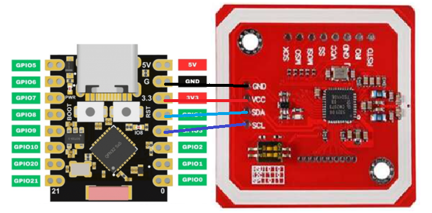
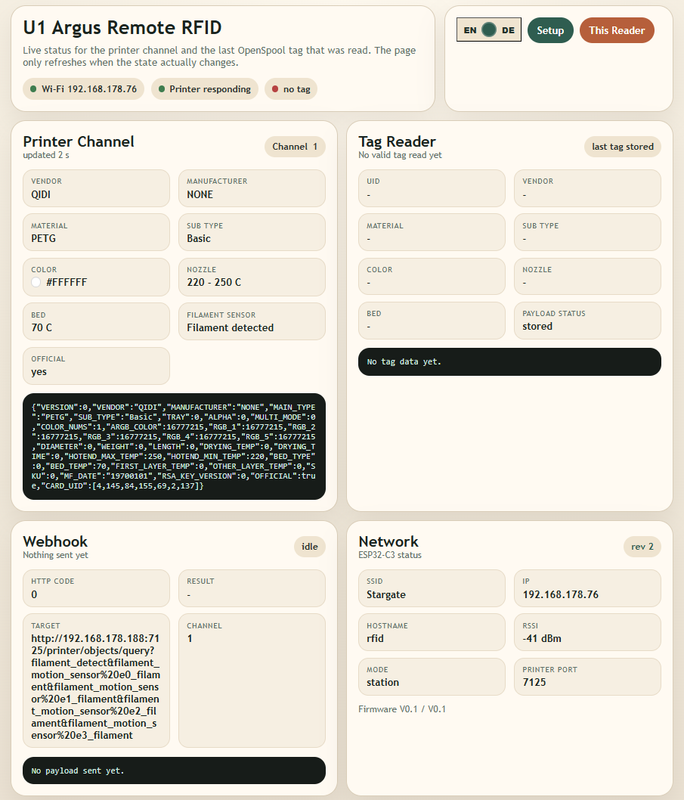
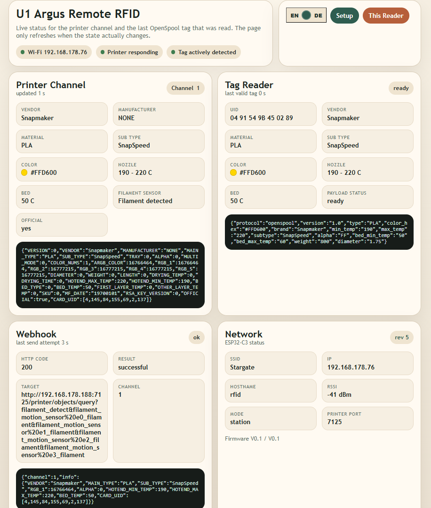
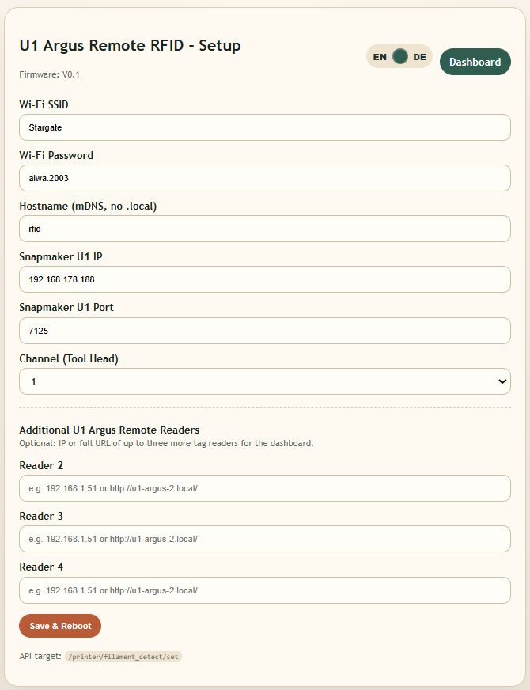
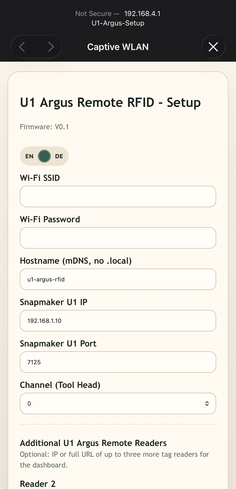

# U1 Argus Remote RFID

<p align="center">
  
</p>

<p align="center">
  Remote OpenSpool and QIDI RFID reader for Snapmaker U1 with ESP32-C3 Super Mini and PN532.
</p>

<p align="center">
  Reads OpenSpool NFC and QIDI MIFARE Classic tags, maps them to the Snapmaker U1 external filament workflow, and shows a beautiful local dashboard with live channel and tag status.
</p>

<p align="center">
  <a href="https://tinkerbarn.github.io/U1-Argus-Remote-RFID/"><strong>Open Web Installer</strong></a>
  ·
  <a href="./index.html"><strong>Installer Source In Repo</strong></a>
</p>

<p align="center">
  <a href="https://ko-fi.com/H2H41XBKJ6">
    
  </a>
</p>

---

## What This Reader Can Do

- Read **OpenSpool Standard** RFID/NFC tags through a **PN532** in **HSU/UART** mode
- Read **QIDI** MIFARE Classic 1K tags with material, vendor, and color mapping
- Upload a reduced QIDI `officiall_filas_list.cfg` through setup and store it persistently on the ESP32-C3
- Send mapped filament information to a **Snapmaker U1** over the external filament-detection API
- Offer a built-in **setup hotspot** with captive portal for first configuration
- Persist Wi-Fi, printer, dashboard-reader, and QIDI mapping settings in ESP32 `Preferences`
- Recover automatically from temporary Wi-Fi outages and return from setup hotspot to station mode
- Reduce printer-side polling load in multi-reader setups by using event-driven full filament refreshes
- Serve a local **dashboard** that shows:
  - current printer channel information
  - last valid tag information
  - last webhook result
  - quick buttons to jump between up to **4 readers**
- Keep the device UI compact and English-only for ESP32-C3 flash headroom
- Support **English and German** in the web installer

---

## Before You Start

This project is intended for **Snapmaker U1** together with the **Extended Firmware by paxx12**:

- [paxx12 / SnapmakerU1-Extended-Firmware (develop)](https://github.com/paxx12/SnapmakerU1-Extended-Firmware/tree/develop)

Required printer-side setting:

- Open `http://<printer-ip>/firmware-config/`
- Set **Filament Detection** to **External**

Without that prerequisite, the remote RFID reader cannot update the U1 channel state correctly.

---

## Hardware

### Bill Of Materials

- **ESP32-C3 Super Mini**
- **PN532 NFC/RFID module**
- **4 hookup wires**
  Usually already included with many PN532 boards

### PN532 Mode

Use the PN532 in **HSU mode**.

Important note:

- On the common red PN532 breakout boards, **HSU/UART is usually already the default mode**
- The printed pin labels may still say `SDA` and `SCL`, even though the board is being used in HSU/UART mode

After the ESP32-C3 has been programmed, only a **USB cable for power** is needed.

The communication between **U1 Argus Remote RFID** and the **Snapmaker U1** then happens entirely over **Wi-Fi**.

---

## Wiring

### Schematic

<p align="center">
  
</p>

### Pinout List

| ESP32-C3 Super Mini | PN532 board pin | Note |
| --- | --- | --- |
| `3V3` | `VCC` | Power |
| `GND` | `GND` | Ground |
| `GPIO3` | `SCL` | HSU TX line to PN532 board |
| `GPIO4` | `SDA` | HSU RX line from PN532 board |

The firmware release `V2.0` uses:

- `PN532_TX_PIN = 3`
- `PN532_RX_PIN = 4`

---

## Installation

### Web Installer

Use the web installer to flash the reader directly from the browser:

- `https://tinkerbarn.github.io/U1-Argus-Remote-RFID/`

Recommended browser:

- **Chrome** or **Edge**

Recommended steps:

1. Connect the **ESP32-C3 Super Mini** by USB
2. Open the web installer
3. Click **Install**
4. Select the correct serial device
5. Wait until flashing is finished

Erase recommendation:

- For a clean install or when replacing other firmware, keep **Erase device** enabled
- For updates from an existing U1 Argus Remote RFID installation, disable erase if you want to keep Wi-Fi, printer, reader, and uploaded QIDI settings

If the board is not detected immediately:

- reconnect the USB cable
- try Chrome or Edge
- on some boards, hold **BOOT** while connecting

If the ESP32-C3 needs to be forced into flashing mode:

1. Press and hold **BOOT**
2. Briefly press **RESET**
3. Release **RESET**
4. Release **BOOT**

Then start the flash process again in the web installer.

### Arduino Source Release

Public release source:

- [source/V2.0/U1_Argus_Remote_RFID_V2.0.ino](./source/V2.0/U1_Argus_Remote_RFID_V2.0.ino)

Development iterations are kept in the local `dev/` folder and are intentionally not published.

### Arduino IDE

If you want to build or flash the source manually in Arduino IDE, install:

#### Board Package

- **ESP32 by Espressif Systems**

Recommended target board for this project:

- **ESP32C3 Dev Module**

#### Required Libraries

- **Adafruit PN532**
- **ArduinoJson**

#### Recommended First-Flash Option

For the first flash onto a board that previously had other firmware, it is recommended to enable:

- **Erase All Flash Before Sketch Upload**

This helps avoid stale settings in `Preferences`/NVS from older firmware.

### macOS Development Tools

This repository includes small helper scripts in `tools/` for local Arduino
development on macOS:

- `tools/check-dev-env.sh`
  Checks Arduino IDE/CLI, ESP32 board support, required libraries, serial ports,
  and the Apple Silicon/Rosetta requirement.
- `tools/install-arduino-deps.sh`
  Installs the ESP32 board package and the required Arduino libraries.
- `tools/compile-firmware.sh`
  Builds `source/V2.0/U1_Argus_Remote_RFID_V2.0.ino` by default.
- `tools/upload-firmware.sh /dev/cu.<device>`
  Builds and uploads the default firmware to a connected ESP32-C3.

Default build target:

- `esp32:esp32:esp32c3` / **ESP32C3 Dev Module**

For the common ESP32-C3 Super Mini variant you can also build with:

```sh
FQBN=esp32:esp32:nologo_esp32c3_super_mini tools/compile-firmware.sh
```

On Apple Silicon Macs, Arduino's bundled `ctags` tool may still be an Intel
binary. If `tools/check-dev-env.sh` reports that Rosetta is missing, install it:

```sh
softwareupdate --install-rosetta --agree-to-license
```

### Repository Layout

Public firmware binaries are stored in `firmware/<version>/`.

The matching Arduino source for each public release is stored in `source/<version>/`.

Local development iterations such as `V1.0.1`, `V1.0.2`, and later candidates live in `dev/`, which is ignored by Git and not part of public releases.

---

## First Setup On The Device

On first boot, the reader opens a device-specific setup hotspot:

- **`U1-Argus-Setup-XXXX`**

The suffix is generated from the ESP32-C3 device ID. This avoids conflicts when several readers are powered at the same time.

Normally the captive portal starts automatically.

If it does not open by itself:

- open `http://192.168.4.1` in the browser

Then configure the reader like this:

1. Enter the SSID of your home Wi-Fi
2. Enter the Wi-Fi password
3. Enter the IP address or mDNS hostname of your Snapmaker U1
4. Keep port `7125` unless you intentionally use a different port
5. Enter an mDNS name
   This must be unique if you use multiple readers
6. Choose the Tool Head the reader belongs to
7. Optionally add already active readers as IP or full URL
   These later appear in the dashboard as quick-jump buttons
8. Save and reboot

After configuration, the dashboard can be opened with:

- `http://example.local`

Replace `example` with the hostname you entered in setup.

---

## Dashboard And Setup Screens

### Dashboard - Channel Status, No Tag Read Yet

<p align="center">
  
</p>

### Dashboard - Tag Read And Channel Updated

<p align="center">
  
</p>

### Setup

<p align="center">
  
</p>

### Captive Portal

<p align="center">
  
</p>

---

## Release V2.0

`V2.0` is the current public release.

Highlights:

- Adds QIDI MIFARE Classic 1K tag support with vendor, material, and color mapping
- Includes compact built-in QIDI Plus4 defaults and optional setup upload for `officiall_filas_list.cfg`
- Stores uploaded QIDI material/vendor mappings persistently in ESP32 `Preferences`
- Speeds up QIDI tag reads through raw PN532 HSU authentication and block reads
- Speeds up large OpenSpool tags with bigger NTAG `FAST_READ` chunks
- Supports larger NTAG/OpenSpool payloads, including tags with opacity, weight, and multiple extra color fields
- Parses OpenSpool JSON only once before building the printer payload and dashboard state
- Keeps standard serial logs for Wi-Fi, mDNS, PN532, NFC read timing, and API activity while keeping verbose debug disabled by default
- Device UI is English-only to preserve ESP32-C3 flash headroom; the web installer remains English/German

Release source:

- [source/V2.0/U1_Argus_Remote_RFID_V2.0.ino](./source/V2.0/U1_Argus_Remote_RFID_V2.0.ino)

Firmware folder:

- [firmware/V2.0](./firmware/V2.0/)

---

## Release V1.3

`V1.3` is the previous public release.

Highlights:

- Snapmaker U1 printer address can now be an IPv4 address or hostname/mDNS name, for example `192.168.1.120` or `u1.local`
- `.local` printer names are resolved through mDNS before printer API URLs are used
- Setup page includes a prefill button for additional reader URLs based on this reader's mDNS name and selected Tool Head
- Prefill keeps already entered reader URLs untouched and only fills empty slots
- Configuration keeps using persistent ESP32 `Preferences` and now includes a config-version marker for future migrations
- Dashboard/API state exposes the configured printer address type for easier diagnostics

Release source:

- [source/V1.3/U1_Argus_Remote_RFID_V1.3.ino](./source/V1.3/U1_Argus_Remote_RFID_V1.3.ino)

Firmware folder:

- [firmware/V1.3](./firmware/V1.3/)

---

## Release V1.2

`V1.2` is the previous public release.

Highlights:

- More robust startup when several readers are powered at the same time
- Device-specific setup hotspot names such as `U1-Argus-Setup-A3F2`
- Configured Wi-Fi gets up to 30 seconds before setup hotspot fallback starts
- While setup hotspot is active, the reader keeps retrying the configured Wi-Fi and automatically returns to station mode when it becomes available
- Lower printer-side polling load in multi-reader setups
- Idle state polls only the reader's own `filament_motion_sensor eX_filament=filament_detected`
- Full `filament_detect=info` refreshes are now event-driven: boot sync, feeder activity, valid tag reads, SET verification, and slow sync
- Successful printer updates are verified and retried if the printer still reports different channel data

Release source:

- [source/V1.2/U1_Argus_Remote_RFID_V1.2.ino](./source/V1.2/U1_Argus_Remote_RFID_V1.2.ino)

Firmware folder:

- [firmware/V1.2](./firmware/V1.2/)

---

## Release V1.1

`V1.1` is the previous public release.

Highlights:

- Better multi-reader dashboard navigation for setups with up to four tool heads
- Saved additional reader IPs/URLs and Tool Head assignments are loaded correctly
- Reduced printer status load when three or four readers are active by querying only the matching motion sensor and staggering status polls
- Clearer Tool Head wording while still showing matching internal Channel numbers
- Improved resend logic: the same tag can be resent if the printer channel does not yet match
- Faster NFC polling while keeping the proven stable PN532 read-window method
- Better reliability for extended OpenSpool tags by avoiding duplicate page reads and duplicate JSON parsing
- Earlier setup hotspot fallback while a slow Wi-Fi connection is still being attempted
- Serial timing log for complete NFC JSON reads

Release source:

- [source/V1.1/U1_Argus_Remote_RFID_V1.1.ino](./source/V1.1/U1_Argus_Remote_RFID_V1.1.ino)

Firmware folder:

- [firmware/V1.1](./firmware/V1.1/)

---

## Release V1.0

`V1.0` is the first public release of this repository.

Highlights:

- ESP32-C3 Super Mini + PN532 in **HSU/UART**
- OpenSpool tag readout over raw PN532 HSU transport
- Snapmaker U1 channel update through external filament-detection workflow
- Captive portal setup with persistent storage
- Live dashboard with printer query, tag state, webhook status, and multi-reader jump links
- English/German support in device UI and web installer

Release source:

- [source/V1.0/U1_Argus_Remote_RFID_V1_0.ino](./source/V1.0/U1_Argus_Remote_RFID_V1_0.ino)

Firmware folder:

- [firmware/V1.0](./firmware/V1.0/)

---

## Credits

Many thanks and biggest respect to:

- [paxx12](https://github.com/paxx12)
- [wasikuss](https://github.com/wasikuss)
- [baze](https://gitlab.com/baze)

This project was built with direct inspiration from their work and, in parts, code structure and implementation ideas.

License details and third-party attribution:

- [LICENSE](./LICENSE)
- [THIRD_PARTY_NOTICES.md](./THIRD_PARTY_NOTICES.md)
