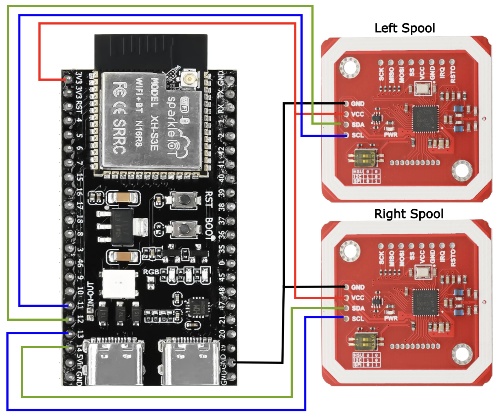

# U1 Argus Remote RFID

<p align="center">
  
</p>

<p align="center">
  Remote OpenSpool and QIDI RFID reader for Snapmaker U1, available as a compact ESP32-C3 single-reader build and a dual-reader ESP32-S3 build.
</p>

<p align="center">
  Reads OpenSpool NFC and QIDI MIFARE Classic tags, maps them to the Snapmaker U1 external filament workflow, and shows a beautiful local dashboard with live channel and tag status.
</p>

<p align="center">
  <a href="https://tinkerbarn.github.io/U1-Argus-Remote-RFID/"><strong>Open Web Installer</strong></a>
  ·
  <a href="./index.html"><strong>Installer Source In Repo</strong></a>
</p>

<p align="center">
  <a href="https://ko-fi.com/H2H41XBKJ6">
    
  </a>
</p>

---

## What This Reader Can Do

- Read **OpenSpool Standard** RFID/NFC tags through one or two **PN532** modules in **HSU/UART** mode
- Read **QIDI** MIFARE Classic 1K tags with material, vendor, and color mapping
- Upload a reduced QIDI `officiall_filas_list.cfg` through setup and store it persistently on the ESP32
- Send mapped filament information to a **Snapmaker U1** over the external filament-detection API
- Offer a built-in **setup hotspot** with captive portal for first configuration
- Persist Wi-Fi, printer, dashboard-reader, and QIDI mapping settings in ESP32 `Preferences`
- Recover automatically from temporary Wi-Fi outages and return from setup hotspot to station mode
- Reduce printer-side polling load in multi-reader setups by using event-driven full filament refreshes
- Serve a local **dashboard** that shows:
  - current printer channel information
  - last valid tag information
  - last webhook result
  - quick buttons to jump between up to **4 readers**
- Provide optional preferred Wi-Fi BSSIDs on current C3 and S3 releases for installations with multiple access points or repeaters; ESP32-S3 also reports visible same-SSID BSSIDs with RSSI
- Protect printer filament metadata after loading: current releases pause the associated RFID reader and do not send tag changes while the assigned Tool Head reports filament detected
- Provide a dual-reader ESP32-S3 firmware with a dedicated NFC polling task
- Provide signed OTA updates for ESP32-S3 from the setup web interface, including upload progress and automatic page reconnection after reboot
- Keep the dashboard responsive when a spool remains parked at a sensor by throttling repeated unchanged S3 tag reads
- Keep the ESP32-C3 device UI compact and English-only because its release build is close to its available application space
- Keep current documentation and the web installer in English

---

## Choose Your Hardware Variant

There are two supported hardware approaches:

| Variant | Readers per controller | Best fit | Architecture |
| --- | ---: | --- | --- |
| **ESP32-C3 Super Mini + 1 PN532** | 1 | Small, low-cost readers; deploy one controller per spool/reader position | Single-core firmware; Wi-Fi, dashboard, printer API, and NFC handling share one MCU core |
| **ESP32-S3 N16R8 + 2 PN532** | 2 | One two-spool reader unit with more expansion room | Dual-core firmware; a FreeRTOS NFC task polls both PN532 readers while the Arduino main loop serves Wi-Fi, dashboard, and printer communication |

### Printable SH02 Base And Reader Holders

A printable mechanical installation for the **Sovol / Comgrow SH02 filament
dryer** is available on MakerWorld:

- [Dual RFID Reader for SH02 Dryer and Snapmaker U1](https://makerworld.com/en/models/2847054-dual-rfid-reader-for-sh02-dryer-and-snapmaker-u1#profileId-3175165)

The design includes the SH02 base plate for the **ESP32-S3 dual-reader**
version and its two PN532 sensor holders. It also includes optional
**ESP32-C3 plus PN532 holders** that fit the same base plate, as well as
universal ESP32-C3 holders for custom installations outside the SH02 base.

Both ESP32-C3 and ESP32-S3 provide 2.4 GHz `802.11 b/g/n` Wi-Fi according to Espressif. The S3 advantage in this project is not a claim of a different Wi-Fi standard: it is the substantially stronger application platform around the network traffic. The ESP32-C3 is a single-core RISC-V MCU up to 160 MHz with 400 KB SRAM. The ESP32-S3 is a dual-core Xtensa LX7 MCU up to 240 MHz with 512 KB internal SRAM and support for larger external flash and PSRAM.

The **ESP32-S3 N16R8** board variant used here is sold as providing 16 MB flash and 8 MB PSRAM. Hardware testing for `V1.3` confirmed the full 16 MB flash capacity. The earlier boot loop was caused by an unsuitable predefined partition table, not by a 4 MB hardware limit. `V1.3` therefore introduces a permanent custom layout with two `6.25 MiB` application slots for safe OTA updates plus approximately `3.4 MiB` of LittleFS space reserved for future protocol/configuration growth. PSRAM is not required by the current firmware; the diagnostic test build did not report active PSRAM on the tested board configuration.

### ESP32-S3 Runtime Split

The ESP32-S3 firmware uses the ESP-IDF/Arduino FreeRTOS runtime:

- **Core 0**: a pinned NFC task alternates the two PN532 readers and performs the time-sensitive OpenSpool/QIDI read path.
- **Core 1**: the Arduino `loop()` continues servicing the web interface, Wi-Fi recovery, printer queries, and outbound tag updates.

This prevents blocking PN532 transactions from making the web/network path compete for the same execution time during a read. The confirmed fast NFC baseline uses raw PN532 HSU detection with `60 ms` detect timeouts and a single QIDI authentication plus block read.

---

## Development And Release Lines

The two controller variants now have different long-term roles:

| Line | Git branch | Purpose |
| --- | --- | --- |
| **ESP32-S3** | `main` | Active development line for new features, additional tag protocols, and future OpenRFID compatibility |
| **ESP32-C3** | `esp32-c3-maintenance` | Stable compact single-reader line; receives bug fixes and compatibility repairs only |

The ESP32-C3 firmware is already close to the practical flash headroom of this hardware variant, so new protocol work will target ESP32-S3. Shared public material such as this README, the web installer, user guides, and published manifests remains on `main`, where both installable hardware variants are presented together.

Hardware-specific release tags avoid ambiguity between versions:

- `esp32-c3-v2.0` marks the C3 maintenance baseline.
- `esp32-c3-v2.1` marks the C3 release with preferred BSSID selection and connected-BSSID dashboard display.
- `esp32-c3-v2.2` marks the C3 release with the filament-loaded safety lock.
- `esp32-s3-v1.0` marks the first S3 release and the starting point for the active development line.
- `esp32-s3-v1.1` marks the S3 release with BSSID/RSSI visibility and persisted additional-reader Tool Head assignments.
- `esp32-s3-v1.2` marks the S3 release with the per-spool filament-loaded safety lock.
- `esp32-s3-v1.3` marks the S3 release with signed OTA updates, online update discovery support, and unchanged-tag throttling.
- `esp32-s3-v1.4` marks the S3 release with the refined setup page and reduced captive-portal setup view.

Public releases are organized consistently by controller:

- ESP32-C3: `source/ESP32-C3/<version>/` and `firmware/ESP32-C3/<version>/`
- ESP32-S3: `source/ESP32-S3/<version>/` and `firmware/ESP32-S3/<version>/`

---

## Before You Start

This project is intended for **Snapmaker U1** together with the **Extended Firmware by paxx12**:

- [paxx12 / SnapmakerU1-Extended-Firmware (develop)](https://github.com/paxx12/SnapmakerU1-Extended-Firmware/tree/develop)

Required printer-side setting:

- Open `http://<printer-ip>/firmware-config/`
- Set **Filament Detection** to **External**

Without that prerequisite, the remote RFID reader cannot update the U1 channel state correctly.

---

## Required Hardware

### ESP32-C3 Single-Reader Bill Of Materials

- **ESP32-C3 Super Mini**
- **PN532 NFC/RFID module**
- **4 hookup wires**
  Usually already included with many PN532 boards
- **USB cable** for flashing and later power

### PN532 Mode

Use the PN532 in **HSU mode**.

Important note:

- On the common red PN532 breakout boards, **HSU/UART is usually already the default mode**
- The printed pin labels may still say `SDA` and `SCL`, even though the board is being used in HSU/UART mode

### ESP32-S3 Dual-Reader Bill Of Materials

- **ESP32-S3 N16R8** board, preferably supplied with a screw-terminal expansion board for easier and more secure PN532 wiring
- **2 x PN532 NFC/RFID modules**
- Hookup wires for power and two independent HSU/UART connections
- **USB cable** for flashing and later power

The reference S3 build uses the N16R8 board with a screw-terminal expansion
board. It makes the two PN532 UART connections easier to assemble and more
robust during normal handling. The expansion board is a wiring convenience,
not a firmware requirement; a compatible ESP32-S3 N16R8 board can also be
wired directly.

Purchase example: [ESP32-S3 N16R8 with screw-terminal expansion board on Amazon.de](https://www.amazon.de/dp/B0FKBLR2KF)

After the controller has been programmed, only a **USB cable for power** is needed.

The communication between **U1 Argus Remote RFID** and the **Snapmaker U1** then happens entirely over **Wi-Fi**.

---

## Wiring

### ESP32-C3 Schematic

<p align="center">
  
</p>

### ESP32-C3 Pinout List

| ESP32-C3 Super Mini | PN532 board pin | Note |
| --- | --- | --- |
| `3V3` | `VCC` | Power |
| `GND` | `GND` | Ground |
| `GPIO3` | `SCL` | HSU TX line to PN532 board |
| `GPIO4` | `SDA` | HSU RX line from PN532 board |

The ESP32-C3 firmware releases `V2.0`, `V2.1`, and `V2.2` use:

- `PN532_TX_PIN = 3`
- `PN532_RX_PIN = 4`

### ESP32-S3 Dual-Reader Schematic

<p align="center">
  
</p>

### ESP32-S3 Dual-Reader Pinout List

| ESP32-S3 N16R8 | PN532 board pin | Reader | Note |
| --- | --- | --- | --- |
| `3V3` | `VCC` | Both | Power |
| `GND` | `GND` | Both | Ground |
| `GPIO11` | `SCL` | Left spool | HSU TX line to PN532 board |
| `GPIO12` | `SDA` | Left spool | HSU RX line from PN532 board |
| `GPIO13` | `SCL` | Right spool | HSU TX line to PN532 board |
| `GPIO14` | `SDA` | Right spool | HSU RX line from PN532 board |

The ESP32-S3 firmware uses two independent UARTs, one for each PN532. The printed `SDA`/`SCL` labels still refer to the PN532 board pins used as HSU serial connections.

---

## Installation

### Web Installer

The web installer supports both public hardware variants directly from the browser:

- `https://tinkerbarn.github.io/U1-Argus-Remote-RFID/`

Available selections:

| Hardware variant | Releases in installer | Default selection |
| --- | --- | --- |
| ESP32-C3 single-reader | `V2.2`, `V2.1`, `V2.0`, `V1.3`, `V1.2`, `V1.1`, `V1.0` | `V2.2` |
| ESP32-S3 dual-reader | `V1.4`, `V1.3`, `V1.2`, `V1.1`, `V1.0` | `V1.4` |

Release lists are ordered newest first; the latest available release for each hardware variant is selected when the page opens.

Recommended browser:

- **Chrome** or **Edge**

Recommended steps:

1. Connect the **ESP32-C3 Super Mini** by USB
2. Open the web installer
3. Click **Install**
4. Select the correct serial device
5. Wait until flashing is finished

The web installer does not offer an erase option. Updating an existing U1
Argus Remote RFID installation therefore keeps stored Wi-Fi, printer, reader,
and uploaded QIDI settings unless settings are cleared separately.

If the board is not detected immediately:

- reconnect the USB cable
- try Chrome or Edge
- on some boards, hold **BOOT** while connecting

If the ESP32-C3 needs to be forced into flashing mode:

1. Press and hold **BOOT**
2. Briefly press **RESET**
3. Release **RESET**
4. Release **BOOT**

Then start the flash process again in the web installer.

### ESP32-S3 Signed OTA Updates

Starting with **ESP32-S3 V1.3**, the setup web interface includes a **Signed
Firmware Update** section:

1. Open the reader setup page using its configured hostname or IP address.
2. The page checks the published ESP32-S3 update catalog automatically; use
   **Check for updates** to repeat the check.
3. If an update is offered, download the `*.ota.signed.bin` file.
4. Select that file under **Signed Firmware Update** and start installation.
5. Follow the upload/verification progress. After the reader reboots, the
   page reconnects and reloads automatically.

OTA installation is deliberately restricted to files signed for this
firmware. A corrupt, unsigned, or incorrect file is rejected before it can
become the active boot image.

Upgrading from **S3 V1.0-V1.2** to **V1.3** must be done once through the web
installer or USB flashing, because those older releases do not yet contain
the permanent dual-slot OTA partition layout. Subsequent S3 releases can use
the signed OTA workflow.

### Arduino Source Releases

ESP32-C3 single-reader public release source:

- [source/ESP32-C3/V2.2/U1_Argus_Remote_RFID_ESP32-C3_V2_2.ino](./source/ESP32-C3/V2.2/U1_Argus_Remote_RFID_ESP32-C3_V2_2.ino)

ESP32-C3 single-reader merged binary:

- [firmware/ESP32-C3/V2.2/U1_Argus_Remote_RFID_ESP32-C3_V2_2.ino.merged.bin](./firmware/ESP32-C3/V2.2/U1_Argus_Remote_RFID_ESP32-C3_V2_2.ino.merged.bin)

ESP32-S3 dual-reader source:

- [source/ESP32-S3/V1.4/U1_Argus_Remote_RFID_ESP32-S3_N16R8_V1_4.ino](./source/ESP32-S3/V1.4/U1_Argus_Remote_RFID_ESP32-S3_N16R8_V1_4.ino)

ESP32-S3 dual-reader web-installer binary and signed OTA update:

- [firmware/ESP32-S3/V1.4/U1_Argus_Remote_RFID_ESP32-S3_N16R8_V1_4.ino.merged.bin](./firmware/ESP32-S3/V1.4/U1_Argus_Remote_RFID_ESP32-S3_N16R8_V1_4.ino.merged.bin)
- [firmware/ESP32-S3/V1.4/U1_Argus_Remote_RFID_ESP32-S3_N16R8_V1_4.ota.signed.bin](./firmware/ESP32-S3/V1.4/U1_Argus_Remote_RFID_ESP32-S3_N16R8_V1_4.ota.signed.bin)

The ESP32-S3 release can be newly installed through the web installer, manually flashed from the merged binary, updated from `V1.3` onward with its signed OTA file in Setup, or built from Arduino source.

### Arduino IDE

If you want to build or flash the source manually in Arduino IDE, install:

#### Board Package

- **ESP32 by Espressif Systems**

Target board for the ESP32-C3 single-reader build:

- **ESP32C3 Dev Module**

Target board for the ESP32-S3 dual-reader build:

- **ESP32S3 Dev Module**

#### Required Libraries

- **Adafruit PN532**
- **ArduinoJson**

#### ESP32-S3 Arduino IDE Settings

For the tested ESP32-S3 dual-reader board, select:

| Arduino IDE option | Value |
| --- | --- |
| Board | `ESP32S3 Dev Module` |
| CPU Frequency | `240MHz (WiFi)` |
| Flash Mode | `QIO 80MHz` |
| Flash Size | `16MB (128Mb)` |
| Partition Scheme | `Custom` using the included `partitions.csv` |
| PSRAM | `OPI PSRAM` |
| Arduino Runs On / Events Run On | `Core 1` / `Core 1` |
| USB CDC On Boot | `Enabled` |
| USB Mode / Upload Mode | `Hardware CDC and JTAG` / `UART0 / Hardware CDC` |

Open the complete `source/ESP32-S3/V1.4/` sketch folder, not the `.ino` file
alone: `partitions.csv`, `build_opt.h`, and `ota_public_key.h` are required for
the signed OTA build. The tested board confirmed `16 MB` flash when using this
custom dual-slot layout. Do not substitute Arduino's predefined
`16M Flash (3MB APP/9.9MB FATFS)` layout because it is not the OTA layout used
by this release.

#### Recommended First-Flash Option

For the first flash onto a board that previously had other firmware, it is recommended to enable:

- **Erase All Flash Before Sketch Upload**

This helps avoid stale settings in `Preferences`/NVS from older firmware.

### macOS Development Tools

This repository includes small helper scripts in `tools/` for local Arduino
development on macOS:

- `tools/check-dev-env.sh`
  Checks Arduino IDE/CLI, ESP32 board support, required libraries, serial ports,
  and the Apple Silicon/Rosetta requirement.
- `tools/install-arduino-deps.sh`
  Installs the ESP32 board package and the required Arduino libraries.
- `tools/compile-firmware.sh`
  Builds `source/ESP32-C3/V2.2/U1_Argus_Remote_RFID_ESP32-C3_V2_2.ino` by default.
- `tools/upload-firmware.sh /dev/cu.<device>`
  Builds and uploads the default firmware to a connected ESP32-C3.

Default build target for the web-installer/C3 release:

- `esp32:esp32:esp32c3` / **ESP32C3 Dev Module**

For the common ESP32-C3 Super Mini variant you can also build with:

```sh
FQBN=esp32:esp32:nologo_esp32c3_super_mini tools/compile-firmware.sh
```

Build the ESP32-S3 dual-reader source with:

```sh
MAX_APP_SIZE=6553600 FQBN='esp32:esp32:esp32s3:FlashSize=16M,PartitionScheme=custom,PSRAM=opi,FlashMode=qio,CPUFreq=240,LoopCore=1,EventsCore=1,USBMode=hwcdc,CDCOnBoot=cdc,UploadMode=default' tools/compile-firmware.sh source/ESP32-S3/V1.4/U1_Argus_Remote_RFID_ESP32-S3_N16R8_V1_4.ino
```

On Apple Silicon Macs, Arduino's bundled `ctags` tool may still be an Intel
binary. If `tools/check-dev-env.sh` reports that Rosetta is missing, install it:

```sh
softwareupdate --install-rosetta --agree-to-license
```

### Repository Layout

Public ESP32-C3 browser-installer firmware binaries are stored in `firmware/ESP32-C3/<version>/`.

The matching ESP32-C3 Arduino source for each public release is stored in `source/ESP32-C3/<version>/`.

ESP32-S3 dual-reader source is stored in `source/ESP32-S3/<version>/`.

ESP32-S3 dual-reader browser-installer/merged binaries are stored in `firmware/ESP32-S3/<version>/`.

ESP32-S3 signed OTA binaries are stored beside the corresponding merged
binaries. The machine-readable update discovery catalog is stored in
`updates/esp32-s3.json`.

Local development iterations live in `dev/`, which is ignored by Git and not part of public releases.

---

## User Guides

- [ESP32-C3 Single-Reader User Guide](./docs/USER_GUIDE_ESP32-C3.md)
- [ESP32-S3 Dual-Reader User Guide](./docs/USER_GUIDE_ESP32-S3.md)

Both guides describe the dashboard, web setup, QIDI `officiall_filas_list.cfg` upload, supported 2.4 GHz Wi-Fi operation, and preferred BSSIDs for installations with multiple access points.

---

## First Setup On The Device

On first boot, the reader opens a device-specific setup hotspot:

- **`U1-Argus-Setup-XXXX`**

The suffix is generated from the controller device ID. This avoids conflicts when several readers are powered at the same time.

Normally the captive portal starts automatically.

If it does not open by itself:

- open `http://192.168.4.1` in the browser

Then configure the reader like this:

1. Enter the SSID of your home Wi-Fi
2. Enter the Wi-Fi password
3. On ESP32-C3 `V2.2` or ESP32-S3 `V1.4`, optionally enter up to two preferred Wi-Fi BSSIDs; visible preferred access points are tried first, with other access points of the same SSID used only when neither preferred BSSID is visible
4. Enter the IP address or mDNS hostname of your Snapmaker U1
5. Keep port `7125` unless you intentionally use a different port
6. Enter an mDNS name
   This must be unique if you use multiple readers
7. Choose the Tool Head assignment: one local reader for ESP32-C3, or left/right spool readers for ESP32-S3
8. Optionally add already active readers as IP or full URL
   These later appear in the dashboard as quick-jump buttons
9. Save and reboot

After configuration, the dashboard can be opened with:

- `http://example.local`

Replace `example` with the hostname you entered in setup.

### Preferred Wi-Fi BSSIDs

A **BSSID** is the MAC address of one specific Wi-Fi access point or repeater
radio, for example `AA:BB:CC:DD:EE:FF`. It becomes useful when several
routers, repeaters, or mesh nodes broadcast the same SSID. Without a preferred
BSSID, the ESP32 may join a more distant node; with one or two preferred
BSSIDs, it can prioritize the nearby 2.4 GHz radios at the printer location.

ESP32-C3 `V2.2` and ESP32-S3 `V1.4` try configured, visible BSSIDs in order.
Only when neither preferred BSSID is visible do they connect to another access
point broadcasting the configured SSID. Enter a BSSID for a **2.4 GHz** radio;
neither ESP32 hardware variant connects to 5 GHz Wi-Fi.

ESP32-S3 `V1.4` additionally lists visible BSSIDs for the configured SSID with
their RSSI values in the dashboard Network tile and in essential serial status
output. For RSSI, a value closer to zero is better, for example `-55 dBm`
indicates a stronger signal than `-83 dBm`.

On Windows, list access points and their BSSIDs in PowerShell or Command
Prompt:

```powershell
netsh wlan show networks mode=bssid
```

For a shorter PowerShell result:

```powershell
netsh wlan show networks mode=bssid | Select-String 'SSID|BSSID|Signal|Channel'
```

On macOS versions that provide Apple's `airport` utility, scan from Terminal:

```sh
/System/Library/PrivateFrameworks/Apple80211.framework/Versions/Current/Resources/airport -s
```

If that command is unavailable on a newer macOS release, open **Wireless
Diagnostics** and choose **Window > Scan**. Holding `Option` while clicking
the Wi-Fi icon also shows the BSSID of the currently connected access point.

---

## Dashboard And Setup Screens

### Dashboard - Channel Status, No Tag Read Yet

<p align="center">
  
</p>

### Dashboard - Tag Read And Channel Updated

<p align="center">
  
</p>

### Setup

<p align="center">
  
</p>

### Captive Portal

<p align="center">
  
</p>

---

## ESP32-C3 Single-Reader V2.2

`V2.2` is the current ESP32-C3 single-reader public release and web-installer
default. It deliberately retains the `V2.1` PN532, OpenSpool, and QIDI tag
read paths.

Highlights:

- Adds optional preference for up to two Wi-Fi BSSIDs for networks with several routers, repeaters, or mesh access points broadcasting the same SSID
- Tries nearby configured 2.4 GHz access points first and falls back to another access point of the SSID only when neither preferred BSSID is visible
- Shows the currently connected BSSID in the dashboard Network tile
- Checks the assigned Tool Head filament sensor immediately before sending tag data and blocks updates after filament is loaded
- Pauses NFC polling while filament remains detected and checks loaded-state changes approximately every five seconds
- Mirrors standard serial status output to the ESP32-C3 USB-Serial/JTAG interface where required by the board profile
- Uses `99%` of the standard ESP32-C3 application partition; future feature development targets ESP32-S3

Source and binary:

- [source/ESP32-C3/V2.2/U1_Argus_Remote_RFID_ESP32-C3_V2_2.ino](./source/ESP32-C3/V2.2/U1_Argus_Remote_RFID_ESP32-C3_V2_2.ino)
- [firmware/ESP32-C3/V2.2/U1_Argus_Remote_RFID_ESP32-C3_V2_2.ino.merged.bin](./firmware/ESP32-C3/V2.2/U1_Argus_Remote_RFID_ESP32-C3_V2_2.ino.merged.bin)

---

## ESP32-S3 Dual-Reader V1.4

`V1.4` is the current public ESP32-S3 N16R8 dual-reader release. It keeps the
`V1.3` RFID, safety, BSSID, and signed OTA behavior while refining the setup
interface.

Highlights:

- Drives two PN532 readers over independent HSU/UART connections for left and right spool positions
- Reads both OpenSpool/NTAG and QIDI/MIFARE Classic tags quickly with the validated raw PN532 HSU path
- Runs NFC polling in a FreeRTOS task pinned to Core 0 while the web interface and printer network workflow remain on the Arduino main loop on Core 1
- Adds optional preference for up to two Wi-Fi BSSIDs, with fallback to another access point of the configured SSID only when neither preferred BSSID is visible
- Shows the connected BSSID plus visible BSSIDs for that SSID with RSSI and channel in the Network tile and serial status output
- Fixes persistence of optional additional dual-reader Tool Head assignments after saving and rebooting
- Checks each assigned Tool Head sensor before sending tag data and blocks changes after filament is loaded
- Pauses RFID polling independently for each loaded spool position while the other reader remains available
- Adds a signed OTA upload in Setup with upload progress, verified installation, restart status, and automatic page reload
- Uses a permanent 16 MB custom partition layout with two `6.25 MiB` OTA slots and reserved LittleFS capacity for future tag-protocol work
- Automatically checks a public S3 update catalog from Setup and offers the latest signed OTA file when a newer release is available
- Throttles an unchanged tag parked at a sensor after three seconds, checking it once every two seconds so the dashboard remains responsive without losing later corrections
- Refines Setup into clearer panels with smaller controls and hides advanced sections in the first-boot captive portal

Source, first-install binary, and OTA update:

- [source/ESP32-S3/V1.4/U1_Argus_Remote_RFID_ESP32-S3_N16R8_V1_4.ino](./source/ESP32-S3/V1.4/U1_Argus_Remote_RFID_ESP32-S3_N16R8_V1_4.ino)
- [firmware/ESP32-S3/V1.4/U1_Argus_Remote_RFID_ESP32-S3_N16R8_V1_4.ino.merged.bin](./firmware/ESP32-S3/V1.4/U1_Argus_Remote_RFID_ESP32-S3_N16R8_V1_4.ino.merged.bin)
- [firmware/ESP32-S3/V1.4/U1_Argus_Remote_RFID_ESP32-S3_N16R8_V1_4.ota.signed.bin](./firmware/ESP32-S3/V1.4/U1_Argus_Remote_RFID_ESP32-S3_N16R8_V1_4.ota.signed.bin)

The browser web installer provides separate ESP32-C3 and ESP32-S3 install targets so the correct chip-specific binary can be selected before flashing.

---

## ESP32-C3 Single-Reader V2.0

`V2.0` is the previous ESP32-C3 single-reader public release.

Highlights:

- Adds QIDI MIFARE Classic 1K tag support with vendor, material, and color mapping
- Includes compact built-in QIDI Plus4 defaults and optional setup upload for `officiall_filas_list.cfg`
- Stores uploaded QIDI material/vendor mappings persistently in ESP32 `Preferences`
- Speeds up QIDI tag reads through raw PN532 HSU authentication and block reads
- Speeds up large OpenSpool tags with bigger NTAG `FAST_READ` chunks
- Supports larger NTAG/OpenSpool payloads, including tags with opacity, weight, and multiple extra color fields
- Parses OpenSpool JSON only once before building the printer payload and dashboard state
- Keeps standard serial logs for Wi-Fi, mDNS, PN532, NFC read timing, and API activity while keeping verbose debug disabled by default
- Device UI and the current web installer are English-only to preserve a compact, consistent public interface

Release source:

- [source/ESP32-C3/V2.0/U1_Argus_Remote_RFID_V2.0.ino](./source/ESP32-C3/V2.0/U1_Argus_Remote_RFID_V2.0.ino)

Firmware folder:

- [firmware/ESP32-C3/V2.0](./firmware/ESP32-C3/V2.0/)

---

## ESP32-C3 Legacy Release V1.3

`V1.3` is the previous public release.

Highlights:

- Snapmaker U1 printer address can now be an IPv4 address or hostname/mDNS name, for example `192.168.1.120` or `u1.local`
- `.local` printer names are resolved through mDNS before printer API URLs are used
- Setup page includes a prefill button for additional reader URLs based on this reader's mDNS name and selected Tool Head
- Prefill keeps already entered reader URLs untouched and only fills empty slots
- Configuration keeps using persistent ESP32 `Preferences` and now includes a config-version marker for future migrations
- Dashboard/API state exposes the configured printer address type for easier diagnostics

Release source:

- [source/ESP32-C3/V1.3/U1_Argus_Remote_RFID_V1.3.ino](./source/ESP32-C3/V1.3/U1_Argus_Remote_RFID_V1.3.ino)

Firmware folder:

- [firmware/ESP32-C3/V1.3](./firmware/ESP32-C3/V1.3/)

---

## Release V1.2

`V1.2` is the previous public release.

Highlights:

- More robust startup when several readers are powered at the same time
- Device-specific setup hotspot names such as `U1-Argus-Setup-A3F2`
- Configured Wi-Fi gets up to 30 seconds before setup hotspot fallback starts
- While setup hotspot is active, the reader keeps retrying the configured Wi-Fi and automatically returns to station mode when it becomes available
- Lower printer-side polling load in multi-reader setups
- Idle state polls only the reader's own `filament_motion_sensor eX_filament=filament_detected`
- Full `filament_detect=info` refreshes are now event-driven: boot sync, feeder activity, valid tag reads, SET verification, and slow sync
- Successful printer updates are verified and retried if the printer still reports different channel data

Release source:

- [source/ESP32-C3/V1.2/U1_Argus_Remote_RFID_V1.2.ino](./source/ESP32-C3/V1.2/U1_Argus_Remote_RFID_V1.2.ino)

Firmware folder:

- [firmware/ESP32-C3/V1.2](./firmware/ESP32-C3/V1.2/)

---

## Release V1.1

`V1.1` is the previous public release.

Highlights:

- Better multi-reader dashboard navigation for setups with up to four tool heads
- Saved additional reader IPs/URLs and Tool Head assignments are loaded correctly
- Reduced printer status load when three or four readers are active by querying only the matching motion sensor and staggering status polls
- Clearer Tool Head wording while still showing matching internal Channel numbers
- Improved resend logic: the same tag can be resent if the printer channel does not yet match
- Faster NFC polling while keeping the proven stable PN532 read-window method
- Better reliability for extended OpenSpool tags by avoiding duplicate page reads and duplicate JSON parsing
- Earlier setup hotspot fallback while a slow Wi-Fi connection is still being attempted
- Serial timing log for complete NFC JSON reads

Release source:

- [source/ESP32-C3/V1.1/U1_Argus_Remote_RFID_V1.1.ino](./source/ESP32-C3/V1.1/U1_Argus_Remote_RFID_V1.1.ino)

Firmware folder:

- [firmware/ESP32-C3/V1.1](./firmware/ESP32-C3/V1.1/)

---

## Release V1.0

`V1.0` is the first public release of this repository.

Highlights:

- ESP32-C3 Super Mini + PN532 in **HSU/UART**
- OpenSpool tag readout over raw PN532 HSU transport
- Snapmaker U1 channel update through external filament-detection workflow
- Captive portal setup with persistent storage
- Live dashboard with printer query, tag state, webhook status, and multi-reader jump links
- English/German support in device UI and web installer

Release source:

- [source/ESP32-C3/V1.0/U1_Argus_Remote_RFID_V1_0.ino](./source/ESP32-C3/V1.0/U1_Argus_Remote_RFID_V1_0.ino)

Firmware folder:

- [firmware/ESP32-C3/V1.0](./firmware/ESP32-C3/V1.0/)

---

## Technical References

- [ESP32-C3 Series Datasheet - Espressif](https://documentation.espressif.com/esp32-c3_datasheet_en.html)
- [ESP32-S3 product overview - Espressif](https://www.espressif.com/en/products/socs/esp32-s3/)
- [ESP-IDF FreeRTOS overview for ESP32-S3 - Espressif](https://docs.espressif.com/projects/esp-idf/en/release-v5.3/esp32s3/api-reference/system/freertos.html)

---

## Credits

Many thanks and biggest respect to:

- [paxx12](https://github.com/paxx12)
- [wasikuss](https://github.com/wasikuss)
- [baze](https://gitlab.com/baze)

This project was built with direct inspiration from their work and, in parts, code structure and implementation ideas.

License details and third-party attribution:

- [LICENSE](./LICENSE)
- [THIRD_PARTY_NOTICES.md](./THIRD_PARTY_NOTICES.md)
